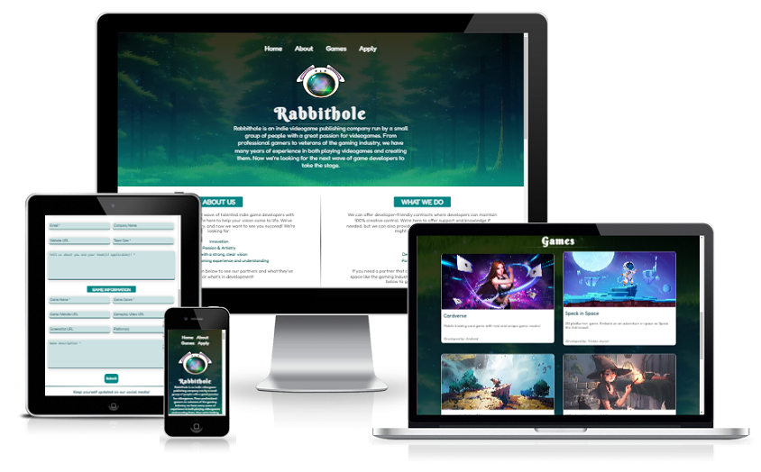
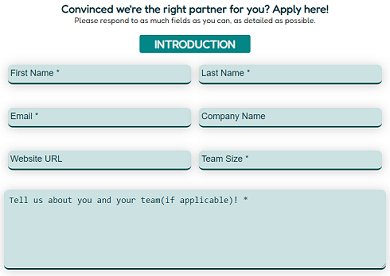
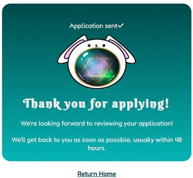
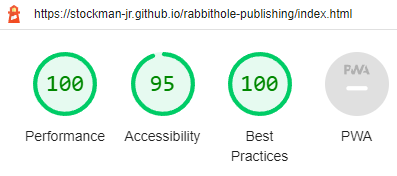
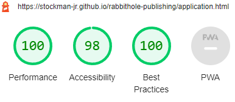
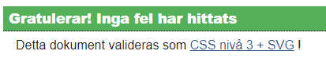
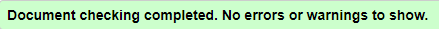

# Rabbithole
Rabbithole is a website created for a fictional indie game publishing company that looks for indie game developers with creative game ideas. The sites main purpose is to find talented
indie game developers who wants to launch a successful game but might not have the resources to do so. That's where Rabbithole can offer developer-friendly contracts and provide them with any publishing needs they might have.

Link to site: https://stockman-jr.github.io/rabbithole-publishing/index.html
- - - 

## Table of Contents

* [UX](#ux)
  * [Site Purpose](#site-purpose)
  * [Site Goal](#site-goal)
  * [Audience](#audience)
* [Design](#design)
  * [Colour Scheme](#colour-scheme)
  * [Typography](#typography)
  * [Imagery](#imagery)
* [Features](#features)
    * [Existing Features](#existing-features)
    * [Future Features](#future-features)
* [Testing](#testing)
    * [Validator Testing](#validator-testing)
    * [Bugs](#bugs)
* [Technologies Used](#technologies-used)
* [Deployment](#deployment)
* [Credits](#credits)

- - - 

## UX

### Site Purpose
To provide information about Rabbithole as a company, what they can offer developers and show off previously published games.

### Site Goal
Build a sense of trust for the company to encourage indie game developers to apply for partnership and update visitors on what games are being developed.

### Audience
The main target audience is indie game developers, but everyone with a love for videogames would be a benefitial audience.

---
## Design

### Colour scheme

This colour scheme, with the addition of black and white, was created and used with the intention of providing as much contrast as possible. It is somewhat based on the colours in the background image of the header and games section, but I selected darker colours since the original image was too bright. Hence why I created a gradient overlay effect on those images.

### Typography
Two fonts were taken from Google Fonts and used throughout the site.
Berkshire Swash was applied h1 headings because I wanted something abit 'fairytaley' to go with the company name. Fredoka was used for the rest of the content, with sans-serif as backup font.

### Imagery
Half of the images on this site was sourced from free stock photo platforms.
The rest was sourced from some incredibly talented artists, all of which will be credited in this document. The background image of the header section was reused in the games section, except I turned it upside down for a subtle, cheeky reference to 'Down the Rabbithole'. The logo was created by me in Procreate.

### Responsive Design
The responsiveness of the site was achieved through the use of flexbox and media queries.

- - -

## Features

### Existing Features

#### Navigation bar:
Included on both pages, allows user to easily navigate between all sections on the 'Home' page and 'Apply' page. All links also has a hover effect.

  

#### The Landing Page:

  * Is the header section of the site, included on both pages.
  * Features the navigation bar, background image, logo, company name and an introduction to Rabbithole.
  * Purpose of this landing page is to immediately inform the user what Rabbithole is all about. I used an animation for the logo to draw the eyes to the middle of the screen where the information is provided.

#### About Section
  * This section provides some more info about the company divided into two parts: what they're looking for and what they can provide for potential partners. It also includes a button that can take you directly to the application page.

  

#### Games Section
  * Consists of cards displaying what games has been created or what's being developed in partnership with Rabbithole.

  * The cards features a small preview of concept art, game title, short game description and name of developer.
    * The intention of this section is to provide more trust for Rabbithole as an already established publishing company.
      The user gets to see what games has been published and is being developed together with Rabbithole, which hopefully drives in more business.

#### Apply Page:
  * This page features a form for developers to send in an application for their game.
The form is divided into two sections with h3 headings in the same style as the h2 headings in the about section - Introduction and Game Information.

 
 

* Proof of form working correctly:

* After testing form, I created a thank you page and directed the user there after submitting application, which displays a thank you message and a link back to 'Home':

#### The Footer: 
  * Includes a heading and social media links, which all opens up in a new tab when clicked.
  
    * The text "Project created for educational purposes only" was added because some of the images in the card section was sourced from talented artists, and I do not have the rights to them. These images will be credited and links to their art portfolios will be provided in this document.

### Future Features
  * Collapsed menu for smaller screens
    * Add a function that would take user to top of the screen

If Rabbithole wasn't a fictional company, I'd add features like:
  * Make the cards in games section actual links that would take the user to another page with more details and updates about the games, or an actual game website.
    * A blog, or a newsfeed of some sort.

---

## Testing

Testing was ongoing throughout the entire build, Chrome Developers Tools was actively used to check for, identify and resolve problems.
I have also used Chrome Dev tools device toolbar to check responsiveness on different screen sizes.
I have tested the website in multiple browsers without noticing any issues:
  * Chrome
  * Mozilla Firefox
  * Microsoft Edge
  * Safari on iPad Air

### Lighthouse Testing
I used Lighthouse in Chrome Dev tools to test performance, accessibility and best practices.

#### Index Page

#### Application Page

### Validator Testing

W3C was used to validate html code on all pages and the CSS code. The css code was approved on first check, some adjustments had to be made to html code to pass.

#### CSS

(Sorry about the Swedish validation)

#### HTML

### Bugs

#### Card Elements & Apply Button
  * **Expected** - to have three cards on each row on bigger screen sizes, and apply button on index page to sit underneath text content.
  * **Testing** - tested different flex properties, launched website through terminal to see different outcomes.
  * **Result** - nothing I tried forced specific elements to a new row.
  * **Fix** - found a solution through this [article](https://tobiasahlin.com/blog/flexbox-break-to-new-row/) by creating a break div set to flex-basis: 100% and width: 0;

  #### Invisible hr element
  * **Expected** - hr element in games section to appear the same as in header content.
  * **Testing** - launched website through terminal to see appearance, tried moving element inside h1 heading, tested different css properties 
  * **Result** - the element was still invisible, or not approved by html validator
  * **Fix** - by selecting #games > hr in css and setting a width of 30%

  #### 
  * **Expected**
  * **Testing**
  * **Result**
  * **Fix**

---

## Technologies Used

### Main Languages Used
  * HTML5
  * CSS3

### Frameworks, Libraries & Programs Used
  * Google Fonts - To find and import fonts used on the website
  * Fontawesome - To add icons
  * GitHub - To save and store files for the website.
  * GitPod
  * Vistual Studio Code(desktop) - For testing and experimenting with code and different layouts. 
  * [tinyPNG](https://tinypng.com/) - For optimizing images.
  * Procreate - To create logo

---

## Deployment

This website was deployed to GitHud pages.The steps to deploy are as follows:
  * In the GitHub repository, navigate to the Settings tab
  * From the source section drop-down menu, select the Master Branch
  * Once the master branch has been selected, the page will be automatically   refreshed with a detailed ribbon display to indicate the successful deployment.

  The live link can be found here: https://stockman-jr.github.io/rabbithole-publishing/

---

## Credits

Text content and some design elements was inspired by this site: [BIGMODE](https://bigmode.com/)

### Code

#### .break Elements
  * The idea of creating these to force a new row was taken from this [article](https://tobiasahlin.com/blog/flexbox-break-to-new-row/)

#### Footer
  * Social media links code was taken from CIs [Love Running Project](https://github.com/Code-Institute-Org/love-running-2.0)

#### Hr elements
  * The css code for the fading look of hr elements was taken from [here](https://css-tricks.com/examples/hrs/)

### Media

#### Images
  * Header and games section bg image - found on [pixabay](https://pixabay.com/) 

#### Card Art
  * 'Cardverse' Art - from [OpenGameArt](https://opengameart.org/content/chess-and-cards-game-girl)
  * 'Speck in Space' Art - from [freepik](http://www.freepik.com): Designed by upklyak.

  The rest of the art were found on pinterest, i will provide direct links to the art but also links to the artists art portfolios.
  * 'Legend of the Skies' - from [link](https://twitter.com/shant_elife/status/1309414165996593153)
    * Art made by Anton Fadeev[@Artstation](https://www.artstation.com/shant)
  * 'Witches' brew of life' - from [link](https://www.artstation.com/artwork/XnaNVY)
    *  Art made by Christina Barton[@Artstation](https://www.artstation.com/chrissabug)
  * 'No-Gravity' - from [link](https://rikelee.cgsociety.org/ly9w/emergency)
    * Art made by rikelee@[cgsociety](https://rikelee.cgsociety.org/)
  * 'Grimwood' - from [link](https://www.deviantart.com/tacosauceninja/art/Woods-Of-Suicide-572712383)
    * Art made by TacoSauceNinja@[deviantart](https://www.deviantart.com/tacosauceninja)

